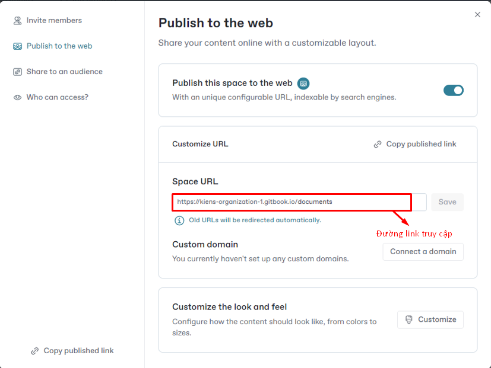

# Publish your docs

Khi ta đã hoàn tất việc viết, chỉnh sửa hoặc nhập nội dung, ta có thể up tài liệu của mình lên web dưới dạng một trang tài liệu. Sau khi được xuất bản, trang của ta sẽ chỉ có thể truy cập trực tuyến hoặc bởi những đối tượng ta chọn.

<figure><figcaption></figcaption></figure>
