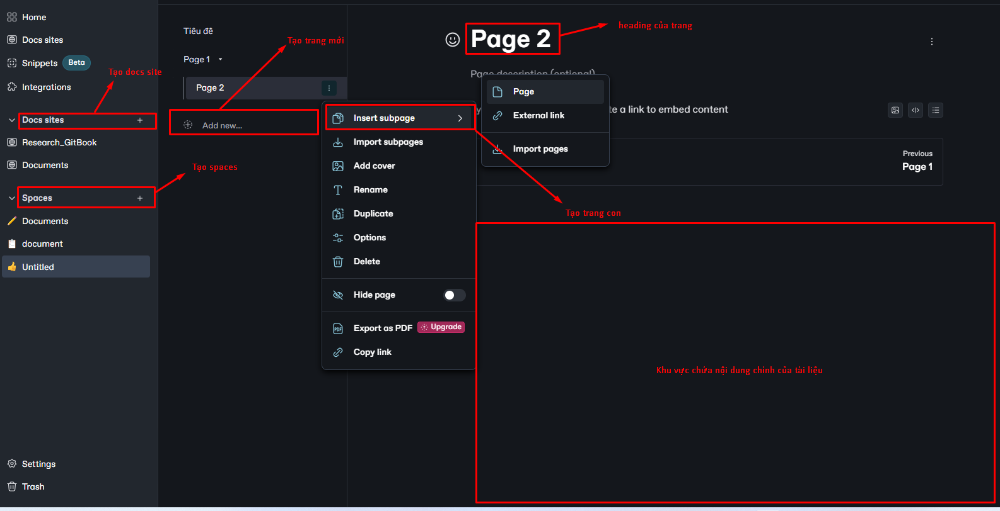

# Quickstart

<figure><figcaption></figcaption></figure>

Sau đây là cái nhìn trực quan cách ta tạo ra một tài liệu cơ bản:\

<figure><figcaption></figcaption></figure>

Docs site: Nơi ta chỉnh sửa và quản lý nội dung, sau đó xuất bản lên web

Spaces: Là các không gian làm việc nơi ta có thể tạo, quản lý và tổ chức tài liệu

Page: là một đơn vị nội dung cơ bản tương tự như một trang tài liệu. Mỗi page có thể chứa văn bản, hình ảnh, mã nguồn, và các khối nội dung khác

Subpage: là các trang con nằm bên trong một trang chính. Chúng giúp tổ chức nội dung theo cấu trúc phân cấp

### Import

GitBook hỗ trợ nhập nội dung từ nhiều công cụ và định dạng viết phổ biến. Nếu đã có sẵn nội dung, ta có thể tải lên và trực tiếp sử dụng.

<figure><figcaption></figcaption></figure>

### Sync a repository

GitBook cũng cho phép  thiết lập đồng bộ hai chiều với kho lưu trữ trên GitHub hoặc GitLab. Việc thiết lập Git Sync cho phép bản thân và nhóm của mình viết nội dung trên GitBook hoặc trong mã nguồn mà không cần lo lắng về việc nội dung bị không đồng bộ.

Kết quả động bộ giữa GitBook và GitHub

<figure><figcaption></figcaption></figure>

Về khả năng quản lý phiên bản của GitBook, chỉ những người được invite vào với role là editor thì mới có quyền được sử đổi, sau khi sửa đổi, editor gửi request cho admin. Admin có thể approve những thay đổi đó, sau đó update lại tài liệu, hoặc gửi phản hồi về cho editor yêu cầu họ chỉnh sửa lại.

<figure><figcaption></figcaption></figure>

Nếu được approve, editor sẽ nhận được thông báo như sau:

<figure><figcaption></figcaption></figure>
