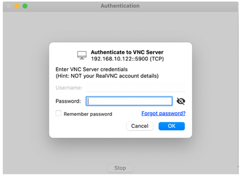
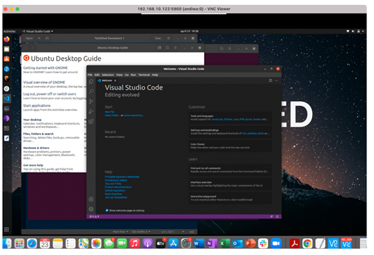

# install and config VNC

**How to Install and Run a VNC Server on Ubuntu Linux 20.04**

Installing a Compatible Display Manager

Ubuntu Linux uses the GNOME Desktop Manager (GDM) as the default display manager. Newer versions of Ubuntu use **gdm3**. Unfortunately, GDM does not usually work very well with the x11vnc server. To overcome this, you will have to install the Light Display Manager, or **lightdm**.

Open the terminal using the **Ctrl + Alt + T** keyboard shortcut. First, update your software sources using **apt**.

**#sudo apt update**

**Then, install lightdm using the below-mentioned command:**

**#sudo apt install lightdm**

The following screen will appear during the installation process. Press the **Enter** key on your keyboard to continue.

.png>)

Next, select the **lightdm** option and press **Enter** on your keyboard.

.png>)

Reboot your PC for the display manager changes to take effect.

.png>)

**#sudo reboot**

You will notice a slight change in the login screen after the reboot because you are now using **lightdm** as your display manager.

**Installing x11vnc Server on Ubuntu**

To install the x11nvc server, open your system terminal by pressing **Ctrl + Alt + T**. Then, run the following command.

**#sudo apt install x11vnc**

Configuring the x11vnc Server

You will now configure a service used for starting the x11nvc server. Create a file named **x11nvc.service** in the /**lib/systemd/system/** directory. This guide uses Vim but you can use any [**other Linux text editor**](https://www.makeuseof.com/tag/linux-text-editor-alternatives/) of your choice e.g. nano.

**#sudo vi /lib/systemd/system/x11vnc.service**

Copy and paste the content below into the newly created service file.

**\[Unit]**

**Description=x11vnc service**

**After=display-manager.service**

**network.target syslog.target**

**\[Service]**

**Type=simple**

**ExecStart=/usr/bin/x11vnc -forever -display :0 -auth guess -passwd randompassword**

**ExecStop=/usr/bin/killall x11vnc**

**Restart=on-failure**

**\[Install]**

**WantedBy=multi-user.target**

The text **randompassword** is the password that you will use for logging in to your server. Edit it and set it to your preferred strong password.

After saving the file, make sure to reload the **systemd** manager configuration and unit files.

**#sudo systemctl daemon-reload**

Then, enable the x11vnc service.

**#sudo systemctl enable x11vnc.service**

Finally, start the VNC server using the command below.

**#sudo systemctl start x11vnc.service**

Check the status of the x11vnc service using systemctl.

**#systemctl status x11vnc.service**

The output should be similar to the one shown below.

.png>)

as you can see from the output above, the service is active and running.

Another important thing to note is the port that the x11vnc server is using (in this case, port **5900**).

**Enabling the Server Port in Your Firewall**

Ubuntu uses the **ufw** firewall by default. To enable other PCs access the Ubuntu system via the port used by the x11vnc server, issue the following command.

**#sudo ufw allow 5900/tcp**

**#sudo ufw reload**

**Connecting From Another Computer**

You can now connect to your Ubuntu system via remote desktop connection using VNC.

You can use any VNC client to connect to the Ubuntu Linux PC. One of the recommended VNC viewers is **VNC Connect** by RealVNC. It is available for almost every major platform including macOS, Linux, Windows, iOS, Android, etc.

**Download:** [https://www.realvnc.com/en/connect/download/viewer/](https://www.realvnc.com/en/connect/download/viewer/)

After downloading the VNC client, install it on your system and launch the application.

This guide uses the macOS installation of VNC Connect but the process would be similar for other operating systems as well.

Enter the IP address of the PC you want to connect to, followed by the port number used by the x11vnc server. Then, press the **Enter** key on your keyboard to connect.

.png>)

**Note: In Ubuntu, you can get your IP address by typing the command below.**

**#ip addr**

The VNC connection will not be encrypted, meaning that anyone who eavesdrops on the network can access the data and view it easily. The password, however, is encrypted. The VNC client will warn you about the unencrypted connection. Select the **Continue** button to proceed.

.png>)

On the next screen, you will be asked to enter a password, which is the **password** you set in the **x11vnc.service** file above. Enter the password accordingly and hit the **Ok** button to continue.

You will now be able to access your PC from another device.

**Disabling Screen Locking**

One of the problems faced while using the x11vnc server is screen locking. However, you can easily fix this issue by disabling the screen lock on your PC.

Head over to **Settings > Privacy > Screen Lock** and make sure you disable the **Automatic Screen Lock** and **Lock Screen on Suspend** options.

**Note**: This is a potential security risk, so be sure to enable it again later. hello 12332131

dat edit&#x20;

dat edit
